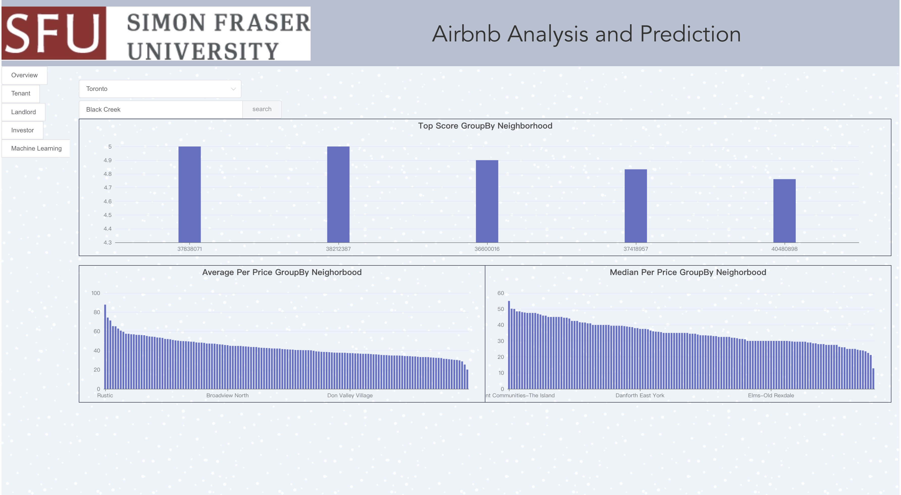
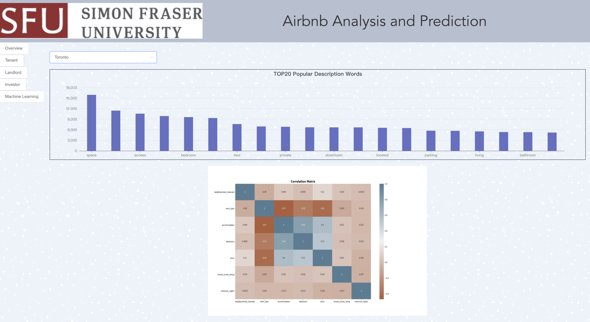

# CMPT-732-Kunkun

<div id="top"></div>


<!-- PROJECT LOGO -->
<br />
<div align="center">
  <a href="">
    
  </a>

  <h1 align="center">Airbnb Data Analysis Website</h1>

  <p align="center">
    A website for analyzing and predicting Airbnb data！
    <br />
    <a href="https://csil-git1.cs.surrey.sfu.ca/yla746/cmpt-732-kunkun"><strong>Explore the docs »</strong></a>
    <br />
    <br />
    ·
    <a href="https://csil-git1.cs.surrey.sfu.ca/yla746/cmpt-732-kunkun/issues">Report Bug</a>
    ·
    <a href="https://csil-git1.cs.surrey.sfu.ca/yla746/cmpt-732-kunkun/issues">Request Feature</a>
  </p>
</div>


<!-- TABLE OF CONTENTS -->
<details>
  <summary>Table of Contents</summary>
  <ol>
    <li>
      <a href="#about-the-project">About The Project</a>
      <ul>
        <li><a href="#built-with">Built With</a></li>
      </ul>
    </li>
    <li>
      <a href="#getting-started">Getting Started</a>
      <ul>
        <li><a href="#installation">Installation</a></li>
        <li><a href="#start-the-project">Start the project</a></li>
      </ul>
    </li>
    <li><a href="#screenshots">Screenshots</a></li>
    <li><a href="#contact">Contact</a></li>
  </ol>
</details>


<!-- ABOUT THE PROJECT -->
## About The Project
Our website is divided into five parts at the functional level, corresponding to the five front-end pages, they are: Overview, Tenant, Landlord, invertor, and Meachine Learning part.

Our website is divided into three parts in the technical architecture: front-end, back-end, and data warehouse. The front-end is responsible for page display, data visualization, and the back-end is responsible for completing the API to realize the interaction between users and data. The data warehouse is responsible for data cleaning, data ETL, data analyzing, Meachine learning, etc.

Some explanations:
* Dataset:<a href="http://insideairbnb.com/get-the-data.html"><strong> Inside Airbnb</strong></a> 
* Currently the project is run locally, corresponding URL: http://127.0.0.1:8000/ (If you need to test in your computer, please contact us.)


<p align="right">(<a href="#top">back to top</a>)</p>


### Built With


* [Django](https://www.djangoproject.com/)
* [Vue.js](https://vuejs.org/)
* [MySQL](https://www.mysql.com/)
* [PySpark](https://spark.apache.org/docs/latest/api/python/index.html)
* [Python3.6+](https://www.python.org/)
* [Node.js](https://nodejs.org/en/)

<p align="right">(<a href="#top">back to top</a>)</p>


<!-- GETTING STARTED -->
## Getting Started

The following commands that need to be executed when running locally, first of all, we have already installed Pyspark by default.

### Installation

* npm
  ```sh
  npm install npm@latest -g
  ```
* Django
  ```sh
  pip install django==1.11.13
  ```
* Vue
  ```sh
  npm install vue
  npm install -g vue-cli
  npm install  vue-resource 
  ```
* element-ui
  ```sh
  npm install element-ui 
  ```


### Start the project

1. Database:  
   create table:
   ```sh
   python manage.py makemigrations airbnb
   python manage.py migrate
   ```
2. Build front-end:
   ```sh
   npm run build
   ```
3. Start project
   ```sh
   python manage.py runserver
   ```

<p align="right">(<a href="#top">back to top</a>)</p>


<!-- USAGE EXAMPLES -->
## Screenshots

<p>Overview</p>

<p>Tenant</p>

<p>Landlord</p>

<p>Investor</p>

<p>Machine Learning</p>


<p align="right">(<a href="#top">back to top</a>)</p>


<!-- CONTACT -->
## Contact

Yizhe Lyu: yla746@sfu.ca
Danlei Qiang: dqa8@sfu.ca  
Jingshan Feng: jfa99@sfu.ca   
Sijia Cai: sca344@sfu.ca  


<p align="right">(<a href="#top">back to top</a>)</p>


